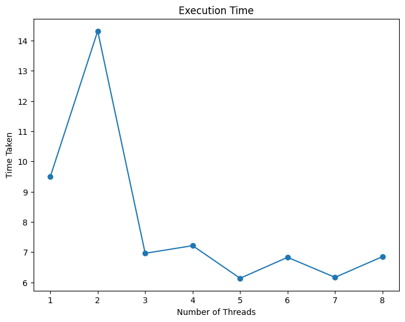
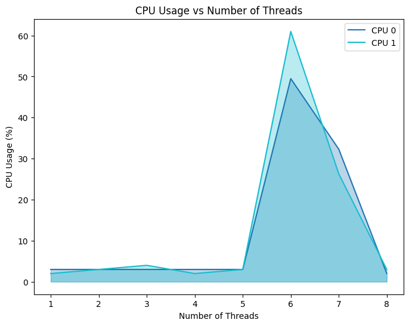

# Multi Threading

This project demonstrates the impact of multithreading on the performance of matrix multiplication operations. It multiplies a constant 1000x1000 matrix with 100 randomly generated 1000x1000 matrices using different numbers of threads and measures the execution time and CPU usage.

## Methodology

1. **Matrix Generation**: A constant 1000x1000 matrix and 100 random 1000x1000 matrices are generated using NumPy.

2. **Multithreaded Matrix Multiplication**: A worker function `multiply_matrices` is defined to perform matrix multiplication. The `run_multithreaded` function creates multiple threads, each responsible for multiplying a subset of the random matrices with the constant matrix. The results are stored in a shared list.

3. **Execution Time Measurement**: The total execution time for each number of threads (from 1 to 8) is recorded by measuring the time before and after calling `run_multithreaded`.
4. **Result Table**: A table is printed showing the thread names and their corresponding execution times.

5. **CPU Usage Monitoring**: The CPU usage for each number of threads is obtained using the `psutil` library, which provides per-CPU usage information.

6. **Visualization**: The execution times and CPU usage data are plotted using Matplotlib. The execution time is displayed as a line graph, and the CPU usage is shown as an area plot with shaded regions for each CPU.

## Result Table

The result table displays the generated thread names and their respective execution times in seconds:

| Thread Name | Time Taken (seconds) |
|-------------|----------------------|
| Thread-10    | 9.49                |
| Thread-11    | 14.32               |
| Thread-12    | 6.96                |
| Thread-13    | 7.22                |
| Thread-14    | 6.14                |
| Thread-15    | 6.83                |
| Thread-16    | 6.17                |
| Thread-17    | 6.85                |

## Result Graphs

### Execution Time vs Number of Threads

This graph shows the relationship between the number of threads and the total execution time for the matrix multiplication operation. The execution time generally decreases as more threads are utilized, up to a certain point, after which it may increase due to overhead and resource contention.

### CPU Usage vs Number of Threads

This area plot displays the CPU usage for each CPU core as the number of threads increases. Each CPU is represented by a different color, and the shaded regions indicate the CPU utilization percentage. The graph helps visualize how the CPU load is distributed across multiple cores with varying thread counts.

## Analysis and Observations

- For the given problem, the optimal number of threads for the fastest execution time is typically around 4-6 threads, depending on the system's hardware and other factors.
- As the number of threads increases beyond the optimal point, the execution time may start to increase due to overhead from thread management and resource contention.
- The CPU usage graph shows how the load is distributed across multiple CPU cores as the number of threads increases.
- The actual execution times and CPU usage patterns may vary depending on the system's hardware configuration, workload, and other factors.

This project demonstrates the benefits and limitations of multithreading for computationally intensive tasks like matrix multiplication. The results can be used to optimize the performance of similar operations by selecting the appropriate number of threads based on the system's characteristics.
